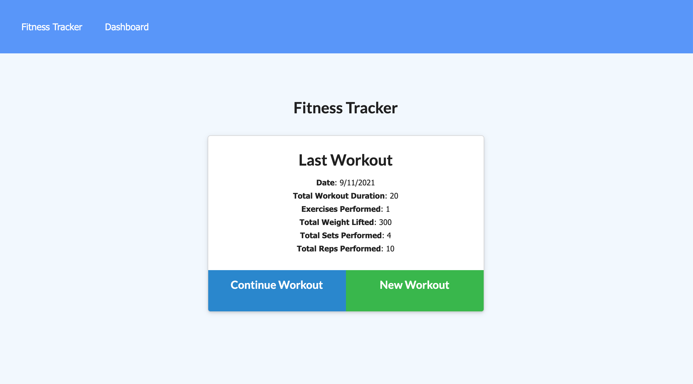

# NoSQL Workout Tracker

 

## Table of Contents
* [Description](#description)
* [Link](#link)
* [Screenshot](#screenshot)
* [Installation](#installation)
* [License](#license)
## Description
A fitness tracker that creates and tracks daily workouts using a Mongo database.

## Link
https://mighty-taiga-85569.herokuapp.com/
## Screenshot

## Installation

*Steps required to install this project and get the application running:*

npm i, npm run seed, npm start

## License
Open

### Questions?

For any questions, please contact me with the information below:

GitHub: [@AF-cmdZ](https://api.github.com/users/AF-cmdZ)
